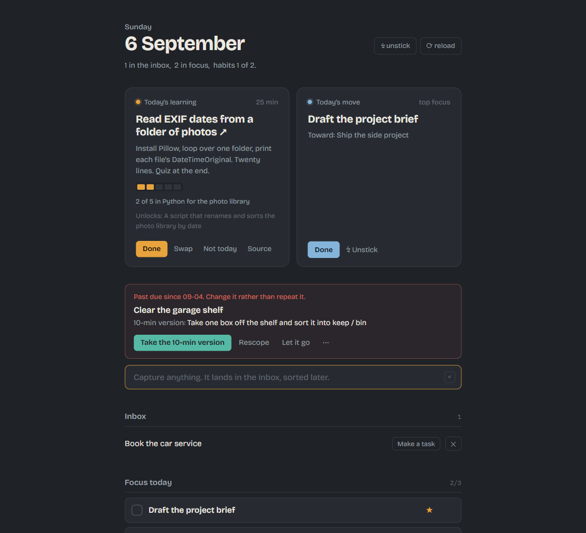

# LifeOS

A personal life operating system for people who ignore things that nag.

One HTML file, a folder of JSON, and an AI assistant that does the weekly thinking. Tasks, habits, goals, and a daily learning card that accumulates toward something you can actually show for it. Built by someone with ADHD, for whom every conventional planner had failed, and designed so that missed days cost nothing and nothing ever pushes.



## What it does

**The morning deck.** A scheduled job opens the app at the hour you sit down. Two cards wait: today's learning card (a 20-30 minute lesson with a payoff in the first line, and progress dots toward a tangible artifact) and today's one move. Done, Swap, or Not today. That is the whole delivery mechanism. No toast, no email.

**Capture, focus, tasks, habits, goals.** Capture is one line and Enter. Focus is capped at three. Habits are capped at five and show a fourteen-day strip with a streak. Goals carry one next action each.

**The overdue mechanic.** A late task is shown once with three ways to change it: take the ten-minute version, flag it for rescoping, or let it go to Someday. It is never pinned, never repeated, never red.

**Unstick.** Stuck on a task? Pick what is in the way (Stuck, Overwhelmed, Unmotivated, Disorganized, Discouraged), get one concrete research-backed intervention and a timer, say whether it worked. Every attempt is logged so patterns surface at the weekly review.

**The rituals.** An AI assistant working in the folder runs four of them: a daily check-in (5-10 min), a weekly curation that restocks the learning deck with lessons built from verified sources (10 min), a weekly review that leads with what you shipped (15-30 min), and a quarterly life portfolio (20-30 min). Ready to go as Claude Code slash commands; portable to any assistant that can read Markdown and edit JSON.

## Quick start

1. Clone or download this repo.
2. Open `lifeos.html` in Chrome or Edge. (It uses the File System Access API; Firefox and Safari don't have it.)
3. Click **Choose LifeOS folder** and pick the folder you cloned into. Chrome asks once; choose *Allow on every visit* and you won't see the screen again.
4. The first learning card is already dealt. It teaches the system in fifteen minutes. Capture three things while you're there.
5. Optional but recommended: open the folder in [Claude Code](https://claude.com/claude-code) and type `/checkin`. Card 2 walks through it. Other assistants: see `docs/AI-INTEGRATION.md`.

### Open it every morning

Schedule `scripts/morning_open.py` for the hour you sit down.

Windows (Task Scheduler, runs with no console window):
```powershell
schtasks /Create /TN "LifeOS Morning Open" /SC DAILY /ST 07:00 /TR "pythonw C:\path\to\lifeos\scripts\morning_open.py"
```

macOS (cron; `crontab -e`):
```
0 7 * * * /usr/bin/python3 /path/to/lifeos/scripts/morning_open.py
```

Linux is the same cron line with your Python path.

## The folder

```
lifeos.html        the app, single file, no build step
data/              your data, plain JSON, yours
learning/          the learning workspace: mission, sources, notes, lessons
reviews/           dated check-in and weekly review logs
scripts/           morning opener and an optional status hook
.claude/skills/    the four rituals, as Claude Code skills
CLAUDE.md          the contract every assistant follows: schemas and rules
AGENTS.md          pointer to the above for tools that read AGENTS.md
docs/              DESIGN.md (why it's like this), AI-INTEGRATION.md (how to wire an assistant)
```

Everything stays on your machine. The only network requests are two Google Fonts stylesheets, and the app works without them.

## Adapting it

This is meant to be forked, reshaped, and if you like, turned into a product. Some places to start:

- **Caps** are two constants at the top of the script in `lifeos.html`.
- **Unstick interventions** are a plain object (`UN_LIB`) in the same file. Rewrite them in your voice.
- **Colours and type** are CSS variables in one `:root` block. The lesson stylesheet in `learning/assets/` shares them.
- **The move card** reads `data/today.json`, which anything can write. That is the hook for feeding it from a calendar, a CRM, a job tracker, whatever your users' "one thing" comes from.
- **The rituals** are Markdown. Change the time caps, the questions, the tone.
- **Weekly habits** would need a `cadence` field; `docs/DESIGN.md` explains why it isn't there and what to watch for.
- **A desktop app**: pywebview wraps this in its own window with about twenty lines of storage changes. Details in `docs/DESIGN.md`.

Read `docs/DESIGN.md` before removing a constraint. Each one is there because the version without it stopped being used.

## Licence

MIT. Use it, sell it, rename it. Attribution appreciated, not required beyond the licence text.
